## Linear Regression Dataset – Azure Automated ML

# Step 1: Create a Compute Cluster 

- Auto ML in Azure is very computational heavy and a compute cluster is required, this scales depending on computational usage -> under compute select Compute clusters and new 

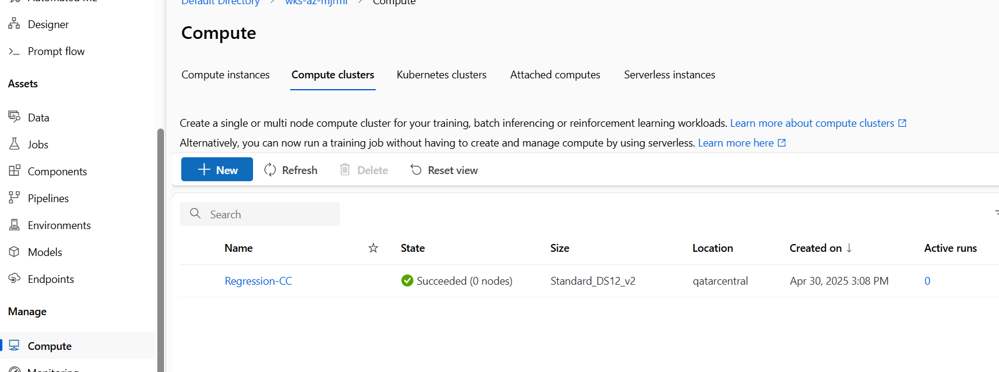 

- Select a CPU or GPU depending how fast you need Auto ML to finish and computational needs and dataset size 

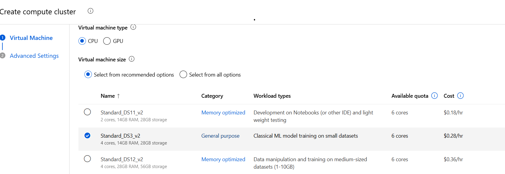 

- Add a compute name and the minimum and maximum number of nodes - **Note: set minimum nodes to 0, you will not be charged for the Compute cluster until the Compute cluster is in use** 

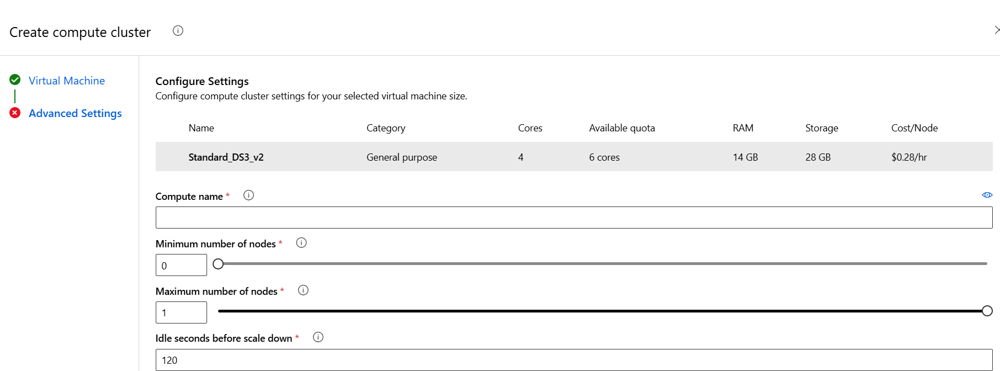 

## Step2:  Open Automated ML and select “New Automated ML JOB” 

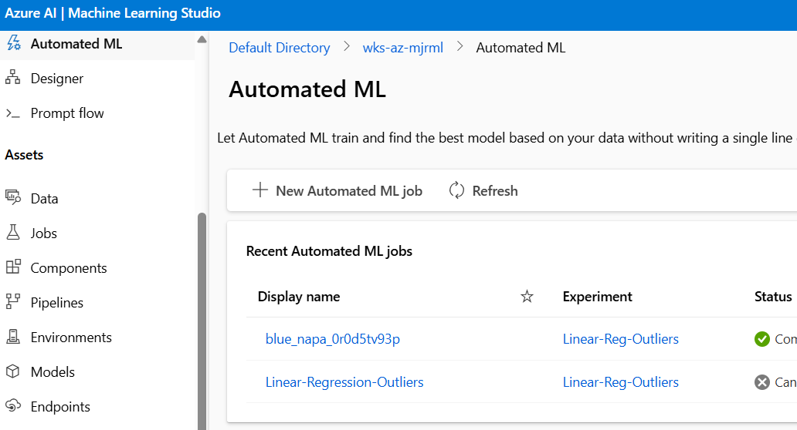 
 
- Fill in the basic info required and next select the task type ‘Regression’ and select the dataset we created earlier for the Designer tool pipeline 

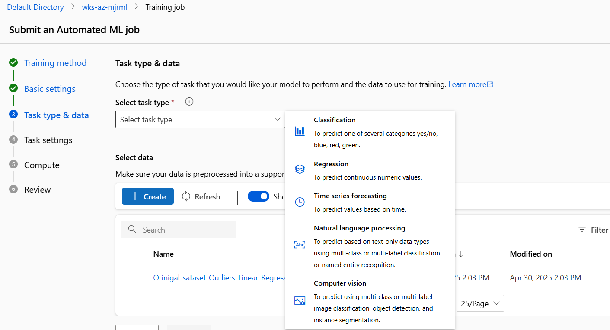 

-Set your Target column and as we split the data 80:20 in our Notebook and Designer we will do the same here 

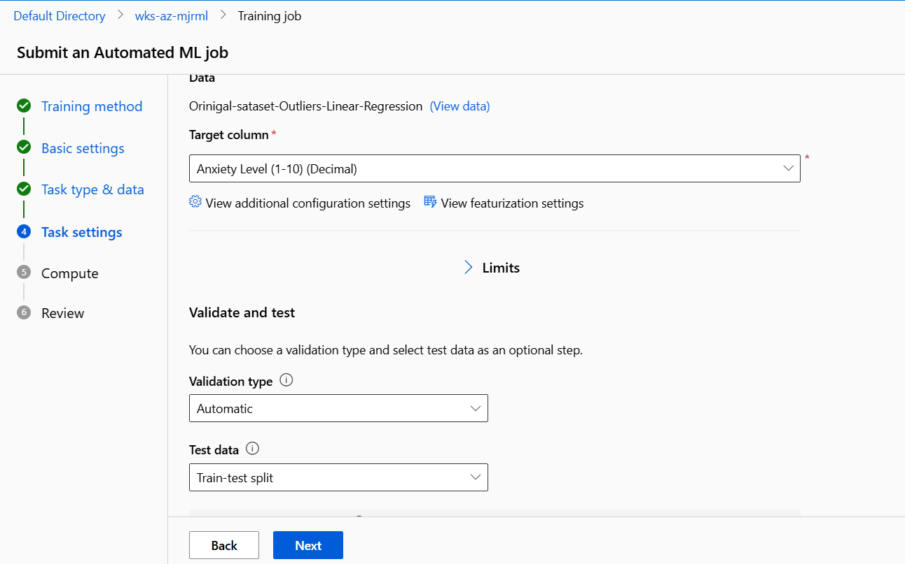 

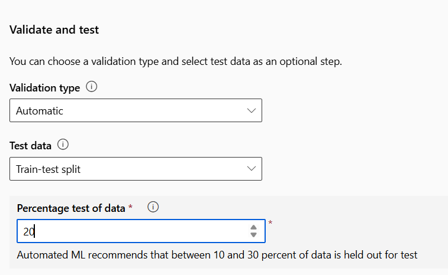 

- Select the Compute cluster you created and run the job  -> This will take some time to run maybe 20 minutes 

## Step 3: When the job has finished you can select the Auto ML job under recent Automated ML Jobs and open the job to see the best fit model – under models and child jobs

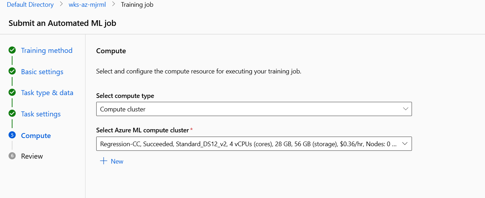 

- Select the first model and open to see the metrics

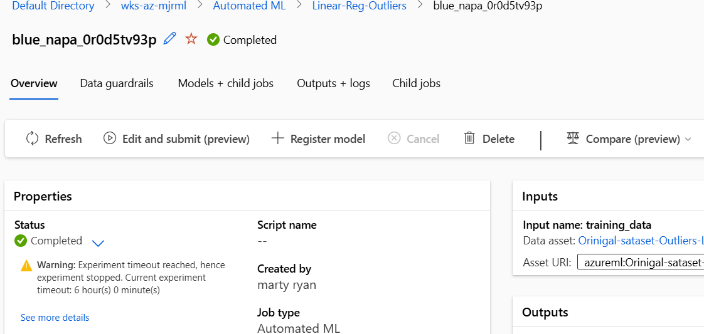

- View the metrics

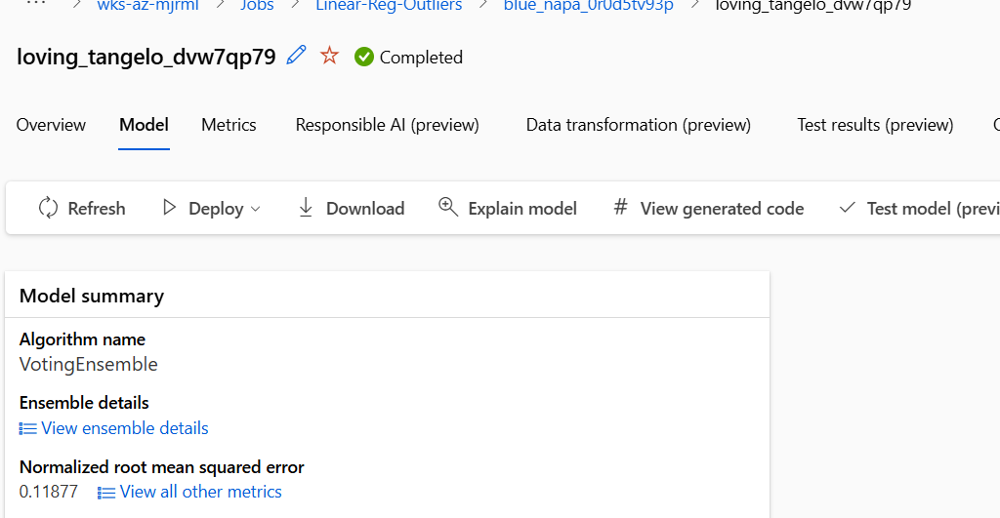

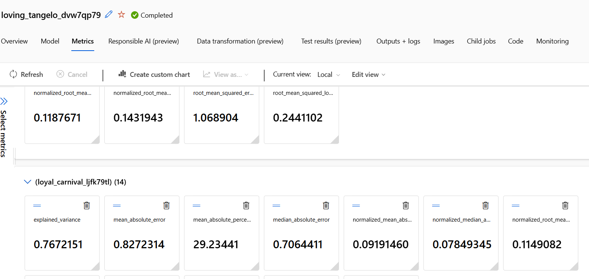
 
  

