# Azure Designer Tool configuration

## Step 1: Create a compute instance to run your Linear regression model – you create this in the Azure Machine Learning workspace under compute

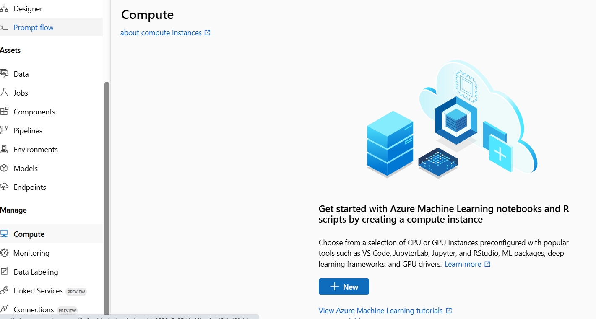

- The designer tool does not require a lot of computational power so a standard VM will work 

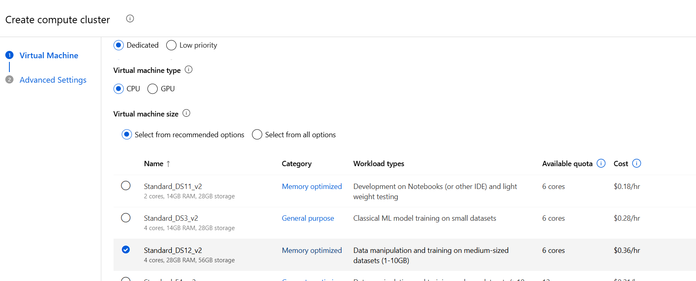

- Enable Auto Shutdown – This will shut down the compute instance after a set time if it is not in use, I would recommend this as it will save on cost 

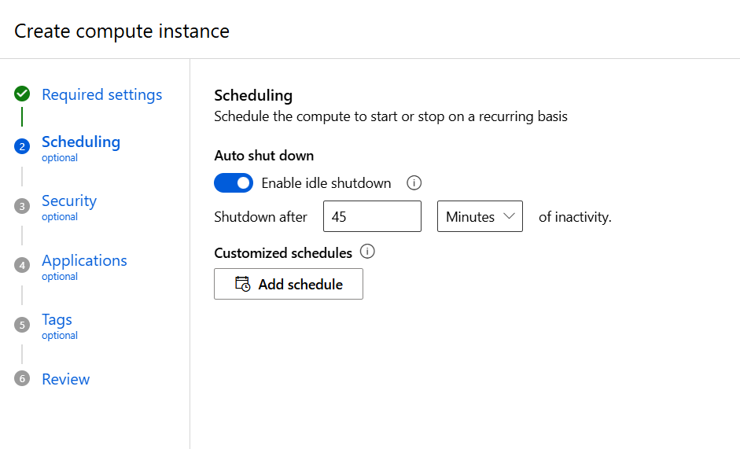

- There is no need to add a setup script so we can skip this part and create our compute instance this will take a few minutes to spin up 

## Step 2: Load your dataset into the Blob storage in your Azure portal – your blob storage is automatically created when creating a Machine Learning workspace in Azure.

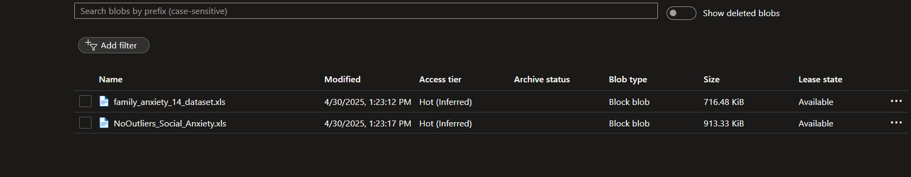

- Next you have to create the dataset in azure machine learning workspace – select data from the right side of the menu and select create 

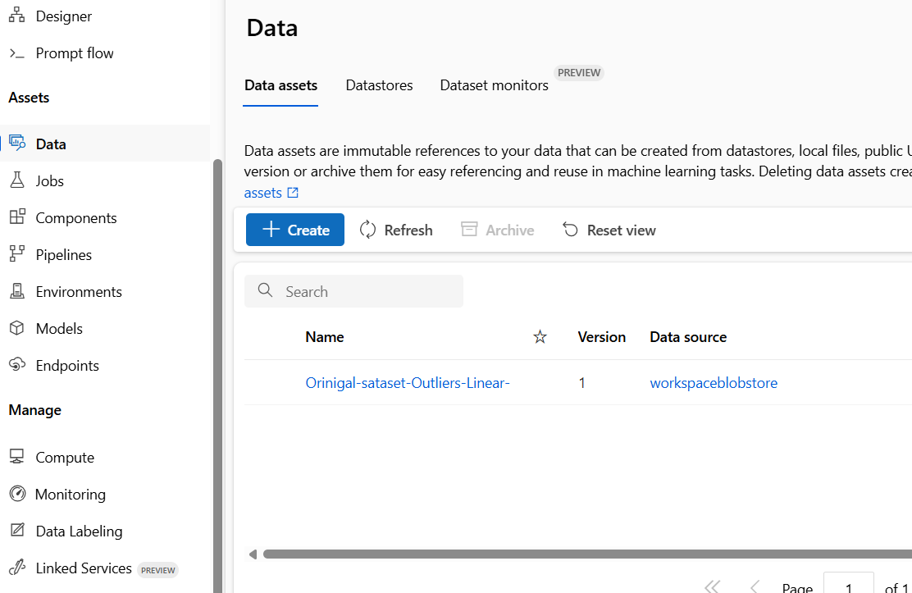

- Enter a name for your dataset and select Tabular –choose a source for your dataset - as you have added the dataset to the blob storage you select FROM AZURE STORAGE 

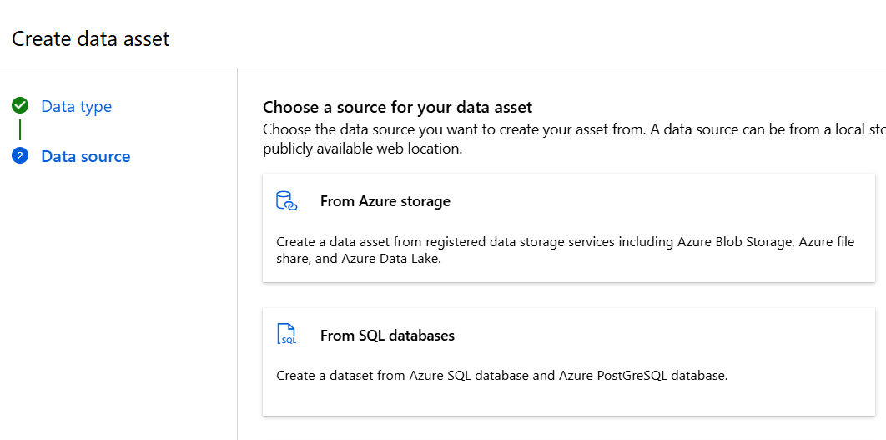

- Select workspaceblobstorage and select your dataset which you added in the azure portal. In here you are allowed to preview the data and determine how the data is parsed. 

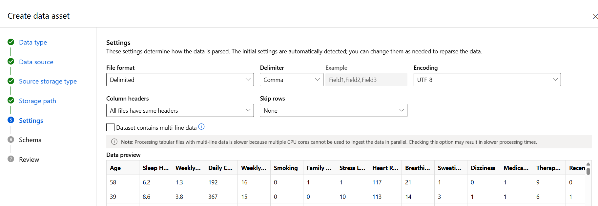

- Next you can view the schema of your dataset and remove columns that are not needed like the first column in our schema below – ‘Path’ and the option to change the Data types 

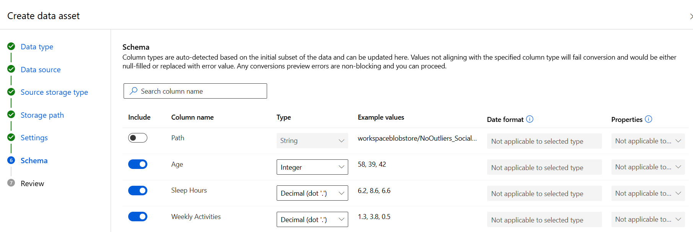
Review and Create 

## Step 3: Designer Tool – New Pipeline 

- In the menu select Designer and select new Pipeline 

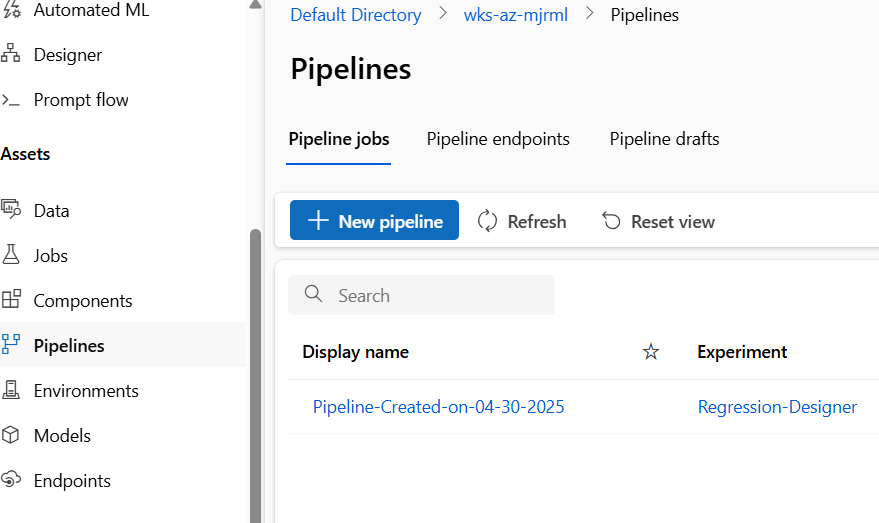

- Select a blank pipeline 

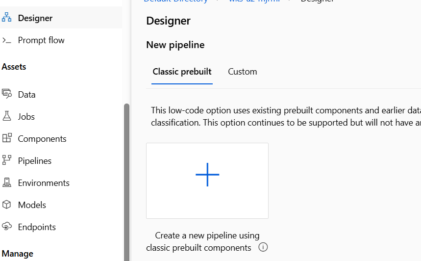

- Drag and drop your newly created dataset to the canvas 

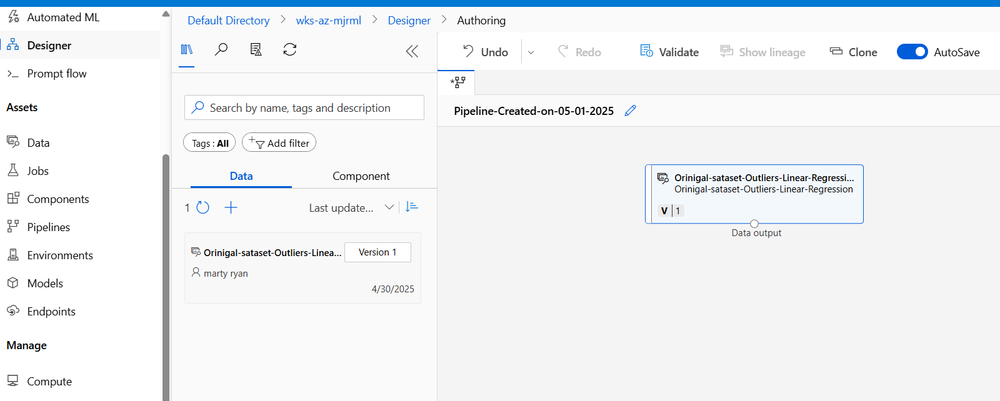

- Below is the final structure of our designer tool for the Linear regression model - drag and drop all the elemnts to canvas - **take note of the split data outputs** 

**Note: you will need to set some parameters like the target column and your split size.**
**When splitting the Data you have an option to drop columns if they are not needed**

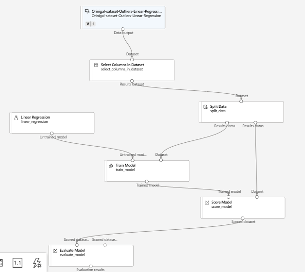.

- When the Pipeline job has finished you can review the metrics and output logs under job overview 

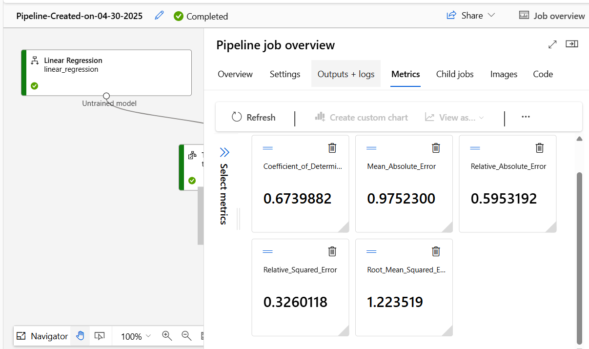.

